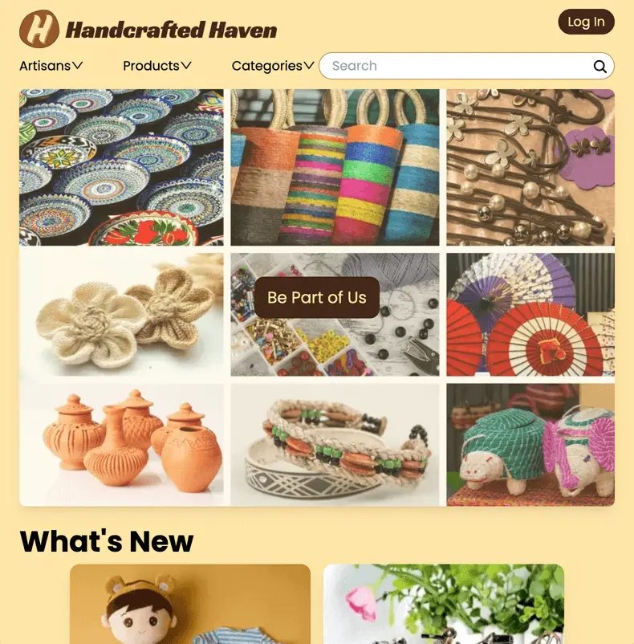

# Handcrafted Haven

## Production Site: 
[https://handcrafted-haven-coral.vercel.app/](https://handcrafted-haven-coral.vercel.app/)

## Overview
Handcrafted Haven is a full-stack commercial web application built with Next.js. It allows users to browse products, manage their profiles, and create and manage posts and purchase records. The platform integrates secure authentication, dynamic API routes, and a responsive user interface to deliver a seamless shopping and content-sharing experience.

## Technology Stack
-- Front-end: React 19, Next.js, Tailwind CSS, Ant Design, Responsive Web Design, Day.js

-- Back-end: Next.js API Routes, PostgresSQL

-- Authentication & Authorization: NextAuth.js, JWT

-- Development Tools & DevOps: TypeScript, ESLint, Vercel, Turbopack,
